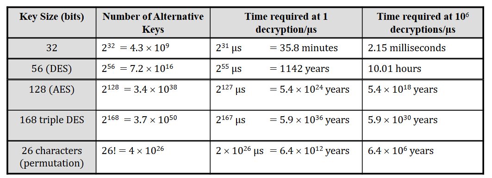

# Symmetric Ciphers (single key, secret)

## Glossary - Terminology
- Plaintext: Original message
- Ciphertext: Encrypted message 
- Cipher: Algorithm for transforming plaintext to ciphertext
- Key: info used only known to the sender and receiver 
- Encipher / Encrypt : converting plaintext to ciphertext 
- Decipher / Decrypt: recovering ciphertext from plain text 
- Cryptography:  study of encryption principles/methods.- Cryptanalysis (codebreaking):  study of principles/ methods of deciphering

ciphertext without knowing key.
- cryptology: field of both cryptography and cryptanalysis.

## General Model
An encryption scheme has five ingredients:
-  Plaintext 
> NOTE There  is 2 ways to handle the plaintext block/stream, Stream cipher is one that encrypts a digital data stream one bit (or byte) at a time. Block cipher is one in which the plaintext is divided in blocks and one block is encrypted at one time producing a ciphertext of equal length.

- Encryption algorithm
-  Secret Key
-  Ciphertext
-  Decryption algorithm

Security depends on the **secrecy of the key**, not the
secrecy of the algorithm (this is assumed to be known)

- Y = E(K, X)
- X = D(K, Y)

#### Type of encryption operations

##### Substitution
Examples o

##### Transposition
##### Product

### Cryptanalysis 

There is mainly 2 types

#### Cryptanalytic: 

This type of attack exploits the
characteristics of the algorithm to attempt to deduce a
specific plaintext or to deduce the key being used.

The basic attacks on encrypted messages are:

- Ciphertext-only attack (COA) the attacker only has access to one or more encrypted messages but knows nothing about the plaintext data.  Only knows algorithm & ciphertext.

- Known-plaintext attack (KPA)• the analyst may have access to some or all of the plaintext of the ciphertext; the analyst's goal in this case is to discover the key used to encrypt/decrypt the message.

- Chosen-plaintext attack (CPA)• the analyst knows the encryption algorithm. The analyst can encrypt the chosen plaintext with the targeted algorithm to derive information about the key.

- Differential cryptanalysis attack• It is a type of chosen plaintext attack that analyzes pairs of plaintexts rather than single plaintexts, so the analyst can determine how the targeted algorithm works when it encounters
different types of data.

#### Brute-force attack: 
The attacker tries every possible
key on a piece of cipher-text until an intelligent
translation into plaintext is obtained.

always possible to simply try every key
most basic attack, proportional to key size
assume either know / recognise plain text

