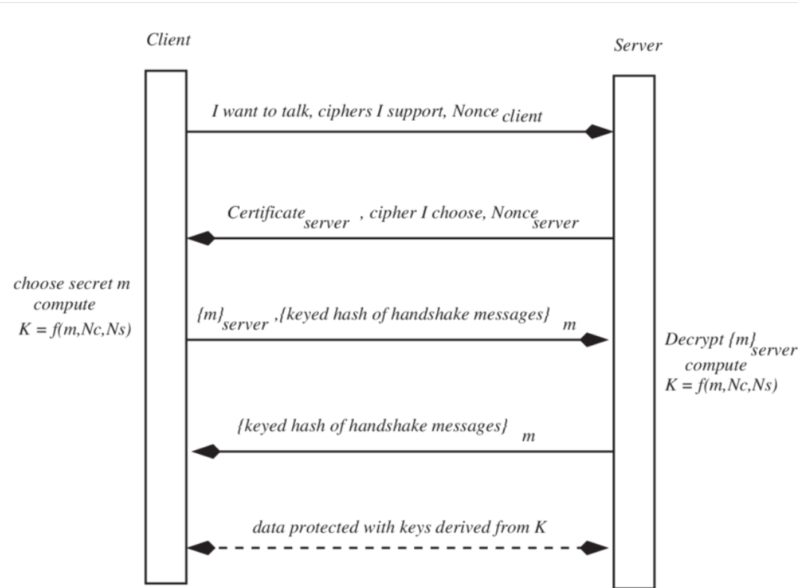

AL - Message - PGP. S/MIME                SHA
TL - Segments - SSL/TLS                   DH
NL - Datagrams - IP/Sec                   AES
DLL - Frames  - WEP / WPA2/ WPA3          RC4
PL  -RT                                   RSA

Both strategies depend on the certificate exchenge betwee a trusteed party for A and B

PKI- public key infrastucture 
It is infrastucture related to the provision of certificates 
PKI as the set of hardware, software people, policies and procedures need to create, store, manage, distribute and revoke digital certificates

PKIs duties are:
Certificate, issuing other protocols
renewal and revocation
Keys storage and update
Providing serces and 

Format X509
Has fields -> M -> H (SHA256) -> H(M) -> Kca- ->  Kca-(H(M)) -> digital signature

It is not possible to use just on certiification authority just by one authority:
Verisign, Amazon Root CA, Microsoft  ECC Root certificate etc...

PKI hierarchical model

CA - CA1 - User1, User2, User3
   - CA2  
   - CA3 

The CA root has signed certificates for CA1 and this one to User1, User2, User3
CA<<CA1>> CA1<<User1>>

But there is not only one root 
Each row has its own hierarchical structure 
The certificate between roots are cross certificates, each root certificate mut validate all others creating a mesh model betweeen root certificates (n * (n-1)), 
The need of certificates is the connection between all the roots defined by (n *(n-1)) which is connections * 2

# web security 
Port 443 
http/tls = https

How does the TL layer works with SSL (uses MAC,  C = MAC(M, key)) and TLS (uses HMAC, Hash + key SHA)

SSL/ TLS
Widely deployed security protocol
TLS transport layer security  can be viewed as SSL v3.1 - provides CIA

The goal was fo fulfill the applications of the ecommerce requirements

SET - was issude by mastercard and visa failed to fill the market

Simple secure communication channel
A ----(Hello)---> B
A <---(Certificate)--- B
Cb
Kb+(MS)--------------> B KB-(KB+(MS)) = MS
                       MS has 4 keys  keyderivatefunction KDF
                       Kc -client to server encryptiion
                       MACc - message auth client to server
                       Ks -server to client encryptiion
                       MACk - message auth server  to client

SSL how does it works
- Handshake 
SYN ACK 3 way hanshake
It is given the K(Master secret to later create the set of keys om the next step)

Real connection simplified SSLv3/TLS

- Key derivation 
 A and B use a shared secret to derivate a set of keys Kc Ks (Encryption - Confidentiality) Ms Mc (HMac - Data integrity and non repudation)

- Data transfer
Confidentiality, Data Integrity (HMAC hash ), Authentication (hash code) <- Non repudation 

- Connection clousure
 FIN , ACK flags to terminate the connection from server to client and client to server 
